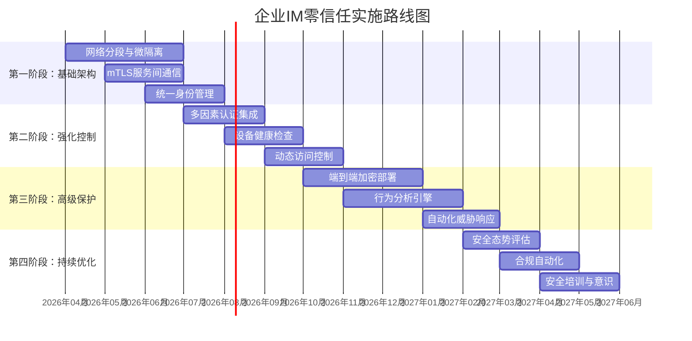

# 零信任架构在即时通讯系统中的应用与实施

> 本文档详细探讨零信任安全模型在即时通讯系统中的实现方案，包括身份验证、网络访问控制、数据保护等关键环节。

## 目录
1. [零信任架构概述](#1-零信任架构概述)
2. [IM系统零信任实施框架](#2-im系统零信任实施框架)
3. [身份认证与授权](#3-身份认证与授权)
4. [网络分段与微隔离](#4-网络分段与微隔离)
5. [数据保护与加密](#5-数据保护与加密)
6. [设备安全与终端保护](#6-设备安全与终端保护)
7. [监控与威胁检测](#7-监控与威胁检测)
8. [实际部署案例](#8-实际部署案例)
9. [挑战与解决方案](#9-挑战与解决方案)

---

## 1. 零信任架构概述

### 1.1 零信任核心原则

零信任的核心思想是"永不信任，总是验证"，与传统边界安全模型的对比：

| 传统边界安全 | 零信任架构 |
|--------------|------------|
| 信任内网，防御外网 | 不信任任何网络 |
| 基于网络位置授权 | 基于身份和设备状态授权 |
| 静态访问控制 | 动态风险评估 |
| 防御重点是边界 | 防御重点是数据和应用 |

### 1.2 零信任七大支柱

根据NIST SP 800-207标准，零信任架构包含：
1. **工作负载保护** - 应用程序和服务的保护
2. **设备安全** - 终端设备的安全验证
3. **身份安全** - 用户和服务的身份管理
4. **网络分段** - 细粒度的网络访问控制
5. **数据安全** - 数据分类和加密保护
6. **可视性与分析** - 全面的监控和日志
7. **自动化和编排** - 安全策略的自动化执行

---

## 2. IM系统零信任实施框架

### 2.1 IM系统零信任架构图

```
┌─────────────────────────────────────────────────────────────┐
│                    零信任控制平面                           │
│  ├─ 身份提供者 (IdP)                                       │
│  ├─ 策略决策点 (PDP)                                       │
│  ├─ 策略执行点 (PEP)                                       │
│  └─ 连续风险评估引擎                                      │
└─────────────────────────────────────────────────────────────┘
                           │
                           ▼
┌─────────────────────────────────────────────────────────────┐
│                    IM系统零信任实施层                       │
├─────────────────────────────────────────────────────────────┤
│ 1. 身份验证层                                              │
│    ├─ 多因素认证 (MFA)                                     │
│    ├─ 设备指纹识别                                         │
│    └─ 生物识别认证                                         │
│                                                            │
│ 2. 网络访问层                                              │
│    ├─ 软件定义边界 (SDP)                                   │
│    ├─ 微隔离策略                                           │
│    └─ TLS 1.3 + mTLS                                       │
│                                                            │
│ 3. 数据保护层                                              │
│    ├─ 端到端加密                                           │
│    ├─ 字段级加密                                           │
│    └─ 数据丢失防护 (DLP)                                   │
│                                                            │
│ 4. 终端安全层                                              │
│    ├─ 设备健康检查                                         │
│    ├─ 应用白名单                                           │
│    └─ 容器化隔离                                           │
└─────────────────────────────────────────────────────────────┘
```

### 2.2 核心组件设计

#### 2.2.1 策略决策点 (PDP)
```yaml
# 策略配置示例
policy:
  name: "im-message-access"
  conditions:
    - user.role: ["admin", "user"]
    - device.health_score: ">= 80"
    - location.trusted_network: true
    - time.access_window: "08:00-18:00"
  actions:
    - allow: ["send_message", "receive_message"]
    - deny: ["file_transfer"]
    - require_mfa: true
```

#### 2.2.2 策略执行点 (PEP)
```go
// 策略执行器示例
type PolicyEnforcer struct {
    PDPEndpoint string
    IdPEndpoint string
}

func (e *PolicyEnforcer) CheckAccess(ctx context.Context, request AccessRequest) (bool, error) {
    // 1. 获取用户上下文
    userCtx := e.GetUserContext(request.UserID)
    
    // 2. 获取设备状态
    deviceStatus := e.CheckDeviceHealth(request.DeviceID)
    
    // 3. 风险评估
    riskScore := e.CalculateRiskScore(userCtx, deviceStatus, request)
    
    // 4. 策略决策
    decision := e.MakePolicyDecision(userCtx, deviceStatus, riskScore, request)
    
    return decision.Allowed, nil
}
```

---

## 3. 身份认证与授权

### 3.1 多因素认证策略

#### 3.1.1 认证流程设计
```
1. 基础认证
   ├─ 用户名/密码
   ├─ OAuth 2.0 / OpenID Connect
   └─ SAML 2.0
   
2. 第二因素验证
   ├─ 时间型OTP (TOTP)
   ├─ 推送通知认证
   ├─ FIDO2 WebAuthn
   └─ 生物识别
   
3. 上下文感知增强
   ├─ 设备指纹匹配
   ├─ 地理位置验证
   ├─ 行为分析
   └─ 网络风险评估
```

#### 3.1.2 JWT增强实现
```python
import jwt
from datetime import datetime, timedelta

class EnhancedJWT:
    def __init__(self, secret_key):
        self.secret_key = secret_key
        
    def create_token(self, user_id, device_id, auth_context):
        """创建包含丰富上下文的JWT"""
        payload = {
            'user_id': user_id,
            'device_id': device_id,
            'auth_level': auth_context['level'],
            'mfa_completed': auth_context['mfa'],
            'device_health': auth_context['device_health'],
            'location': auth_context['location'],
            'iat': datetime.utcnow(),
            'exp': datetime.utcnow() + timedelta(hours=1),
            'iss': 'im-zero-trust-system',
            'aud': 'im-service'
        }
        
        return jwt.encode(payload, self.secret_key, algorithm='HS256')
    
    def verify_token(self, token, context_check=True):
        """验证令牌并检查上下文"""
        try:
            payload = jwt.decode(token, self.secret_key, algorithms=['HS256'])
            
            if context_check:
                # 检查设备健康状态
                if payload.get('device_health', 0) < 70:
                    raise Exception("Device health check failed")
                
                # 检查地理位置变化
                if self.check_location_anomaly(payload['location']):
                    raise Exception("Suspicious location change")
            
            return payload
        except jwt.ExpiredSignatureError:
            # 令牌过期，触发重新认证流程
            self.trigger_reauth_flow(payload['user_id'])
            raise
```

### 3.2 设备指纹与信任评估

#### 3.2.1 设备指纹收集
```javascript
// 设备指纹收集脚本
class DeviceFingerprint {
    collect() {
        return {
            // 浏览器特征
            userAgent: navigator.userAgent,
            language: navigator.language,
            platform: navigator.platform,
            screenResolution: `${screen.width}x${screen.height}`,
            colorDepth: screen.colorDepth,
            
            // 硬件特征
            cpuCores: navigator.hardwareConcurrency,
            deviceMemory: navigator.deviceMemory,
            
            // 网络特征
            connection: navigator.connection?.effectiveType,
            ipAddress: '', // 通过后端获取
            
            // 行为特征
            timezone: Intl.DateTimeFormat().resolvedOptions().timeZone,
            fonts: this.detectFonts(),
            canvasFingerprint: this.generateCanvasFingerprint(),
            webglFingerprint: this.generateWebGLFingerprint(),
            
            // 加密特征
            publicKey: this.generateDeviceKey()
        };
    }
}
```

#### 3.2.2 信任评分模型
```python
class TrustScoreCalculator:
    def calculate_score(self, user_context, device_data, request_context):
        score = 100  # 初始分数
        
        # 设备因素 (权重40%)
        device_score = self.calculate_device_score(device_data)
        score += device_score * 0.4
        
        # 行为因素 (权重30%)
        behavior_score = self.calculate_behavior_score(user_context)
        score += behavior_score * 0.3
        
        # 环境因素 (权重20%)
        environment_score = self.calculate_environment_score(request_context)
        score += environment_score * 0.2
        
        # 时间因素 (权重10%)
        time_score = self.calculate_time_score(user_context)
        score += time_score * 0.1
        
        # 异常检测扣分
        anomalies = self.detect_anomalies(user_context, device_data, request_context)
        for anomaly in anomalies:
            score -= anomaly['severity'] * 10
        
        return max(0, min(100, score))
```

---

## 4. 网络分段与微隔离

### 4.1 软件定义边界 (SDP)

#### 4.1.1 SDP架构设计
```
┌─────────────────────────────────────────────────────────┐
│                   SDP控制器                            │
│  ├─ 认证服务                                           │
│  ├─ 策略管理                                           │
│  ├─ 证书颁发                                           │
│  └─ 日志审计                                           │
└─────────────────────────────────────────────────────────┘
            │
            ▼
┌─────────────────────────────────────────────────────────┐
│                  SDP网关/入口节点                       │
│  ┌─────────────────────────────────────────────────┐   │
│  │  TLS握手验证                                    │   │
│  │  mTLS双向认证                                  │   │
│  │  流量代理与转发                                │   │
│  └─────────────────────────────────────────────────┘   │
└─────────────────────────────────────────────────────────┘
            │
            ▼
┌─────────────────────────────────────────────────────────┐
│                IM微服务集群 (隐藏网络)                  │
│  ┌─────────────┐ ┌─────────────┐ ┌─────────────┐       │
│  │ 消息服务    │ │ 用户服务    │ │ 文件服务    │       │
│  └─────────────┘ └─────────────┘ └─────────────┘       │
│                                                        │
│  ┌─────────────┐ ┌─────────────┐ ┌─────────────┐       │
│  │ 推送服务    │ │ 群组服务    │ │ 存储服务    │       │
│  └─────────────┘ └─────────────┘ └─────────────┘       │
└─────────────────────────────────────────────────────────┘
```

#### 4.1.2 mTLS配置示例
```yaml
# Istio mTLS配置
apiVersion: security.istio.io/v1beta1
kind: PeerAuthentication
metadata:
  name: im-zero-trust-mtls
  namespace: im-production
spec:
  mtls:
    mode: STRICT
  selector:
    matchLabels:
      app: im-service
---
apiVersion: networking.istio.io/v1beta1
kind: DestinationRule
metadata:
  name: im-mtls-destination-rule
spec:
  host: "*.im-service.svc.cluster.local"
  trafficPolicy:
    tls:
      mode: ISTIO_MUTUAL
      sni: im-service.internal
```

### 4.2 微隔离策略

#### 4.2.1 网络策略示例
```yaml
# Kubernetes网络策略
apiVersion: networking.k8s.io/v1
kind: NetworkPolicy
metadata:
  name: im-message-service-policy
spec:
  podSelector:
    matchLabels:
      app: message-service
  policyTypes:
  - Ingress
  - Egress
  ingress:
  - from:
    - podSelector:
        matchLabels:
          app: auth-service
    ports:
    - protocol: TCP
      port: 8080
  egress:
  - to:
    - podSelector:
        matchLabels:
          app: database-service
    ports:
    - protocol: TCP
      port: 5432
```

---

## 5. 数据保护与加密

### 5.1 分层加密策略

#### 5.1.1 加密层次设计
```
1. 传输层加密
   ├─ TLS 1.3 (所有外部通信)
   ├─ mTLS (服务间通信)
   └─ 自定义加密隧道 (高敏感场景)
   
2. 应用层加密
   ├─ 端到端加密 (Signal Protocol)
   ├─ 字段级加密 (敏感数据字段)
   └─ 数据库列级加密
   
3. 存储层加密
   ├─ 磁盘加密 (全盘加密)
   ├─ 对象存储加密
   └─ 备份加密
```

#### 5.1.2 字段级加密实现
```python
from cryptography.fernet import Fernet
from cryptography.hazmat.primitives import hashes
from cryptography.hazmat.primitives.kdf.pbkdf2 import PBKDF2HMAC
import base64
import os

class FieldLevelEncryption:
    def __init__(self, master_key):
        self.master_key = master_key
        
    def encrypt_field(self, field_name, field_value, user_context):
        """字段级加密"""
        # 为每个字段生成唯一密钥
        field_key = self.derive_field_key(field_name, user_context)
        
        # 加密字段值
        fernet = Fernet(field_key)
        encrypted = fernet.encrypt(field_value.encode())
        
        return {
            'encrypted_value': base64.b64encode(encrypted).decode(),
            'key_id': self.get_key_id(field_name, user_context),
            'algorithm': 'AES-256-GCM'
        }
    
    def derive_field_key(self, field_name, user_context):
        """派生字段特定密钥"""
        salt = f"{field_name}:{user_context['user_id']}".encode()
        
        kdf = PBKDF2HMAC(
            algorithm=hashes.SHA256(),
            length=32,
            salt=salt,
            iterations=100000,
        )
        
        field_key = base64.urlsafe_b64encode(kdf.derive(self.master_key))
        return field_key
```

### 5.2 密钥管理方案

#### 5.2.1 密钥管理架构
```go
// 密钥管理服务
type KeyManagementService struct {
    HSMClient   *cloudkms.Client  // 硬件安全模块
    KMSClient   *aws.KMS          // 云KMS服务
    Cache       *redis.Client     // 密钥缓存
}

func (k *KeyManagementService) GetDataKey(ctx context.Context, keyID string) ([]byte, error) {
    // 1. 检查缓存
    if cached, found := k.Cache.Get(ctx, keyID); found {
        return cached, nil
    }
    
    // 2. 从HSM获取主密钥
    masterKey, err := k.HSMClient.GetKey(ctx, "im-master-key")
    if err != nil {
        return nil, err
    }
    
    // 3. 派生数据密钥
    dataKey, err := k.KMSClient.GenerateDataKey(ctx, &kms.GenerateDataKeyInput{
        KeyId:         &masterKey.KeyID,
        KeySpec:       aws.String("AES_256"),
        NumberOfBytes: aws.Int64(32),
    })
    
    if err != nil {
        return nil, err
    }
    
    // 4. 缓存结果
    k.Cache.Set(ctx, keyID, dataKey.Plaintext, 5*time.Minute)
    
    return dataKey.Plaintext, nil
}
```

---

## 6. 设备安全与终端保护

### 6.1 设备健康检查

#### 6.1.1 检查项目
```json
{
  "device_health_checks": {
    "os_integrity": {
      "enabled": true,
      "checks": [
        "secure_boot_enabled",
        "kernel_integrity",
        "system_updates_current"
      ]
    },
    "security_software": {
      "enabled": true,
      "checks": [
        "antivirus_installed",
        "antivirus_up_to_date",
        "firewall_enabled"
      ]
    },
    "application_security": {
      "enabled": true,
      "checks": [
        "im_app_signed",
        "no_debuggers_attached",
        "certificate_pinning_valid"
      ]
    },
    "device_configuration": {
      "enabled": true,
      "checks": [
        "disk_encryption_enabled",
        "screen_lock_enabled",
        "developer_mode_disabled"
      ]
    }
  }
}
```

#### 6.1.2 健康评分计算
```python
class DeviceHealthScorer:
    def calculate_score(self, check_results):
        total_weight = 0
        weighted_score = 0
        
        for category, checks in check_results.items():
            for check_name, result in checks.items():
                weight = self.get_check_weight(check_name)
                total_weight += weight
                
                if result['passed']:
                    weighted_score += weight
                else:
                    # 根据严重程度扣分
                    severity = result.get('severity', 'medium')
                    if severity == 'high':
                        weighted_score -= weight * 0.5
                    elif severity == 'critical':
                        weighted_score -= weight
        
        if total_weight > 0:
            final_score = max(0, (weighted_score / total_weight) * 100)
        else:
            final_score = 0
            
        return final_score
```

### 6.2 容器化隔离

#### 6.2.1 Docker安全配置
```dockerfile
# 安全强化版Dockerfile
FROM gcr.io/distroless/base-debian11

# 以非root用户运行
USER 1000:1000

# 复制应用程序
COPY --chown=1000:1000 app /app

# 设置安全上下文
WORKDIR /app

# 限制能力
RUN setcap -r /app/bin/*

# 健康检查
HEALTHCHECK --interval=30s --timeout=3s \
  CMD curl -f http://localhost:8080/health || exit 1

# 暴露端口
EXPOSE 8080

# 入口点
ENTRYPOINT ["/app/bin/im-service"]
```

#### 6.2.2 容器运行时安全
```yaml
# Pod安全策略
apiVersion: policy/v1beta1
kind: PodSecurityPolicy
metadata:
  name: im-restricted-psp
spec:
  privileged: false
  allowPrivilegeEscalation: false
  requiredDropCapabilities:
    - ALL
  volumes:
    - 'configMap'
    - 'emptyDir'
    - 'secret'
  hostNetwork: false
  hostIPC: false
  hostPID: false
  runAsUser:
    rule: 'MustRunAsNonRoot'
  seLinux:
    rule: 'RunAsAny'
  supplementalGroups:
    rule: 'MustRunAs'
    ranges:
      - min: 1
        max: 65535
  fsGroup:
    rule: 'MustRunAs'
    ranges:
      - min: 1
        max: 65535
  readOnlyRootFilesystem: true
```

---

## 7. 监控与威胁检测

### 7.1 安全信息与事件管理 (SIEM)

#### 7.1.1 日志收集架构
```
┌─────────────────────────────────────────────────────────┐
│                    IM应用层日志                         │
│  ├─ 认证日志                                           │
│  ├─ 访问控制日志                                       │
│  ├─ 业务操作日志                                       │
│  └─ 异常行为日志                                       │
└─────────────────────────────────────────────────────────┘
            │
            ▼
┌─────────────────────────────────────────────────────────┐
│                   基础设施日志                          │
│  ├─ 网络流量日志                                       │
│  ├─ 系统调用日志                                       │
│  ├─ 容器运行时日志                                     │
│  └─ 云平台审计日志                                     │
└─────────────────────────────────────────────────────────┘
            │
            ▼
┌─────────────────────────────────────────────────────────┐
│                安全数据湖 (SIEM)                        │
│  ├─ 实时流处理                                         │
│  ├─ 威胁情报集成                                       │
│  ├─ 行为分析引擎                                       │
│  └─ 机器学习模型                                       │
└─────────────────────────────────────────────────────────┘
            │
            ▼
┌─────────────────────────────────────────────────────────┐
│                    威胁检测与响应                       │
│  ├─ 实时告警                                           │
│  ├─ 自动化响应                                         │
│  ├─ 事件调查                                           │
│  └─ 合规报告                                           │
└─────────────────────────────────────────────────────────┘
```

#### 7.1.2 威胁检测规则
```yaml
# Sigma规则示例
title: Suspicious IM Message Flood
id: 9a3b2c1d-4e5f-6a7b-8c9d-0e1f2a3b4c5d
status: experimental
description: Detects unusually high message frequency from a single user
author: IM Security Team
logsource:
  product: im
  service: message
detection:
  selection:
    event_type: "message_sent"
  condition: selection | count() by user_id > 1000 within 1m
falsepositives:
  - Automated messaging services
  - Group broadcast messages
level: medium
tags:
  - attack.t1562.001
  - im.security
```

### 7.2 用户与实体行为分析 (UEBA)

#### 7.2.1 行为基准建立
```python
class BehaviorBaseline:
    def build_baseline(self, user_id, historical_data):
        """建立用户行为基准"""
        baseline = {
            'messaging_patterns': self.analyze_messaging_patterns(historical_data),
            'login_patterns': self.analyze_login_patterns(historical_data),
            'device_usage': self.analyze_device_usage(historical_data),
            'geographic_patterns': self.analyze_geographic_patterns(historical_data),
            'social_graph': self.build_social_graph(historical_data)
        }
        
        return baseline
    
    def detect_anomalies(self, current_behavior, baseline):
        """检测行为异常"""
        anomalies = []
        
        # 消息发送频率异常
        if self.is_frequency_anomaly(current_behavior['message_rate'], 
                                    baseline['messaging_patterns']['avg_rate']):
            anomalies.append({
                'type': 'message_frequency_anomaly',
                'severity': 'medium',
                'confidence': 0.85
            })
        
        # 地理位置异常
        if self.is_location_anomaly(current_behavior['location'], 
                                   baseline['geographic_patterns']):
            anomalies.append({
                'type': 'geographic_anomaly',
                'severity': 'high',
                'confidence': 0.92
            })
        
        # 社交图异常
        if self.is_social_graph_anomaly(current_behavior['contacts'], 
                                       baseline['social_graph']):
            anomalies.append({
                'type': 'social_graph_anomaly',
                'severity': 'low',
                'confidence': 0.75
            })
        
        return anomalies
```

---

## 8. 实际部署案例

### 8.1 企业级IM系统零信任实施

#### 8.1.1 架构概览
```
企业零信任IM系统架构：
├── 客户端层
│   ├─ 移动应用 (iOS/Android)
│   ├─ 桌面应用 (Windows/macOS/Linux)
│   └─ Web应用
│
├── 访问层
│   ├─ SDP网关 (Cloudflare Zero Trust / Zscaler)
│   ├─ 身份代理 (Okta / Azure AD)
│   └─ Web应用防火墙 (WAF)
│
├── 控制平面
│   ├─ 策略引擎 (OpenPolicyAgent / Styra)
│   ├─ 证书管理 (Cert-Manager / Vault)
│   └─ 密钥管理 (HSM / Cloud KMS)
│
├── 数据平面
│   ├─ IM微服务集群 (Kubernetes)
│   ├─ 消息队列 (Kafka / NATS)
│   └─ 数据库集群 (PostgreSQL + Redis)
│
└── 安全运维
    ├─ SIEM平台 (Splunk / Elastic)
    ├─ 威胁情报 (CrowdStrike / SentinelOne)
    └─ 安全编排 (SOAR)
```

#### 8.1.2 实施阶段


### 8.2 成本效益分析

#### 8.2.1 投资回报分析
| 投资项目 | 初始成本 | 年运营成本 | 安全收益 | ROI周期 |
|----------|----------|------------|----------|----------|
| SDP网关 | $50,000 | $10,000 | 减少80%攻击面 | 18个月 |
| 统一身份 | $30,000 | $5,000 | 统一访问控制 | 12个月 |
| 设备管理 | $20,000 | $3,000 | 设备合规率95%+ | 15个月 |
| 加密系统 | $40,000 | $8,000 | 数据泄露风险降低90% | 24个月 |
| 监控分析 | $60,000 | $12,000 | 威胁检测时间缩短70% | 20个月 |

#### 8.2.2 风险缓解效果
```python
# 风险评分计算
def calculate_risk_reduction(zero_trust_implementation):
    baseline_risk = 100  # 传统架构风险评分
    
    risk_reducers = {
        'network_segmentation': 0.30,  # 降低30%网络攻击风险
        'mtls_encryption': 0.25,       # 降低25%窃听风险
        'mfa_authentication': 0.40,    # 降低40%账户被盗风险
        'device_health_check': 0.35,   # 降低35%恶意软件风险
        'behavior_analytics': 0.20,    # 降低20%内部威胁风险
    }
    
    implemented = zero_trust_implementation['implemented_features']
    total_reduction = 0
    
    for feature in implemented:
        if feature in risk_reducers:
            total_reduction += risk_reducers[feature]
    
    # 剩余风险
    remaining_risk = baseline_risk * (1 - total_reduction)
    
    return {
        'baseline_risk': baseline_risk,
        'risk_reduction_percent': total_reduction * 100,
        'remaining_risk': remaining_risk,
        'risk_reduction_ratio': f"{(baseline_risk - remaining_risk) / baseline_risk:.1%}"
    }
```

---

## 9. 挑战与解决方案

### 9.1 常见挑战

#### 9.1.1 性能影响
**挑战**：零信任架构增加的加密、认证和策略检查可能影响系统性能。

**解决方案**：
```yaml
performance_optimizations:
  caching_strategy:
    auth_tokens: "5分钟缓存"
    policy_decisions: "1分钟缓存"
    device_health: "30分钟缓存"
  
  async_operations:
    risk_assessment: "异步执行"
    log_collection: "批量处理"
    reporting: "定时任务"
  
  hardware_acceleration:
    crypto_operations: "硬件加密卡"
    tls_termination: "专用负载均衡器"
    packet_inspection: "智能网卡"
```

#### 9.1.2 用户体验
**挑战**：频繁的认证和验证可能影响用户体验。

**解决方案**：
```javascript
// 智能认证流程
class SmartAuthentication {
    async authenticate(context) {
        // 1. 检查会话状态
        if (await this.hasValidSession(context)) {
            return { authenticated: true, method: 'session' };
        }
        
        // 2. 检查设备信任
        if (await this.isTrustedDevice(context.deviceId)) {
            return { authenticated: true, method: 'device_trust' };
        }
        
        // 3. 检查行为模式
        if (await this.matchesBehaviorPattern(context)) {
            return { authenticated: true, method: 'behavioral' };
        }
        
        // 4. 需要完整认证
        return {
            authenticated: false,
            required_auth: this.getRequiredAuthLevel(context.risk),
            challenge: this.generateAuthChallenge(context)
        };
    }
}
```

#### 9.1.3 运维复杂性
**挑战**：零信任架构增加了系统的运维复杂度。

**解决方案**：
```python
# 自动化运维脚本
class ZeroTrustAutomation:
    def auto_remediate(self, security_incident):
        """自动化修复安全事件"""
        actions = []
        
        if security_incident.type == 'device_compromise':
            # 隔离受感染设备
            actions.append(self.isolate_device(security_incident.device_id))
            
            # 重置设备信任
            actions.append(self.reset_device_trust(security_incident.device_id))
            
            # 通知用户
            actions.append(self.notify_user(
                security_incident.user_id,
                'device_security_alert'
            ))
        
        elif security_incident.type == 'credential_stuffing':
            # 强制密码重置
            actions.append(self.force_password_reset(security_incident.user_id))
            
            # 增强监控
            actions.append(self.enable_enhanced_monitoring(
                security_incident.user_id,
                duration='7d'
            ))
        
        return actions
```

### 9.2 未来发展趋势

#### 9.2.1 技术演进方向
```
1. AI驱动的自适应安全
   ├─ 机器学习威胁检测
   ├─ 预测性风险评估
   └─ 自动化响应编排

2. 去中心化身份
   ├─ DID (去中心化身份标识)
   ├─ 可验证凭证
   └─ 区块链身份验证

3. 同态加密应用
   ├─ 隐私保护计算
   ├─ 加密数据搜索
   └─ 安全多方计算

4. 量子安全密码学
   ├─ 后量子密码算法
   ├─ 量子密钥分发
   └─ 抗量子攻击架构
```

#### 9.2.2 标准与合规
```yaml
# 合规框架映射
compliance_frameworks:
  gdpr:
    applicable_controls:
      - data_minimization
      - encryption_at_rest
      - access_logging
    zero_trust_implementation:
      - data_classification
      - field_level_encryption
      - comprehensive_audit_trail
  
  hipaa:
    applicable_controls:
      - access_controls
      - audit_controls
      - integrity_controls
    zero_trust_implementation:
      - role_based_access
      - immutable_logging
      - digital_signatures
  
  soc2:
    applicable_controls:
      - security
      - availability
      - confidentiality
    zero_trust_implementation:
      - continuous_monitoring
      - disaster_recovery
      - information_protection
```

---

## 总结

零信任架构为即时通讯系统提供了全面的安全保护，从传统的边界防御转向以身份和设备为中心的动态安全模型。通过实施分层加密、细粒度访问控制和持续风险评估，IM系统可以在保持良好用户体验的同时，显著提升安全防护能力。

### 关键成功因素：
1. **渐进式部署** - 分阶段实施，优先保护关键资产
2. **自动化运维** - 减少人工干预，提高响应速度
3. **用户教育** - 提高安全意识，减少人为风险
4. **持续改进** - 定期评估和优化安全策略

### 未来展望：
随着AI、区块链和量子计算等新技术的发展，零信任架构将变得更加智能、自适应和抗攻击。即时通讯系统作为关键通信基础设施，应持续投资于安全创新，确保在日益复杂的威胁环境中保持强大的防御能力。

---
*文档版本: 1.0*
*更新日期: 2026-03-22*
*作者: 轻舞飞扬 (IM安全架构师)*
*版权声明: 本文档内容仅供参考，实际实施请结合具体环境进行评估。*